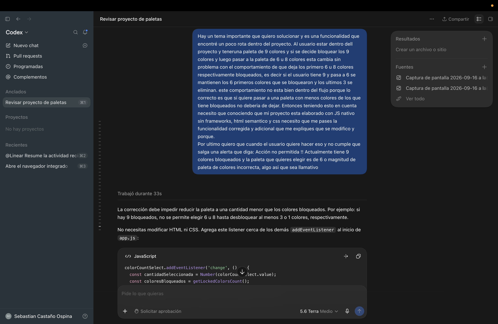
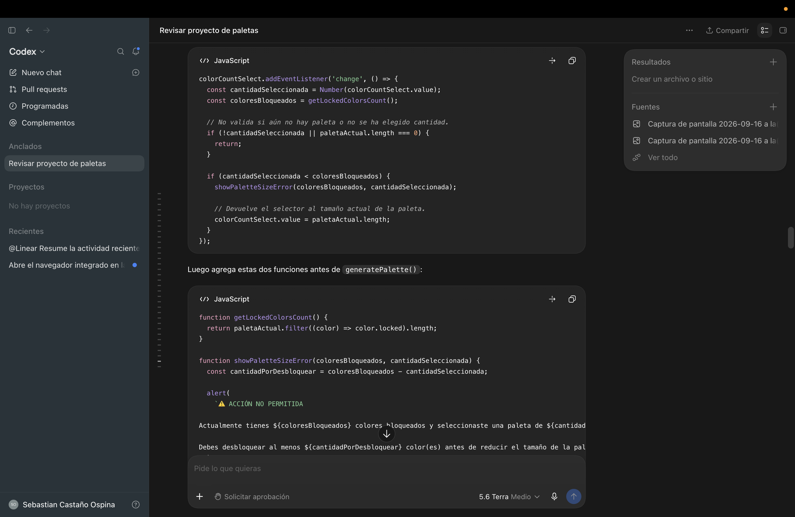
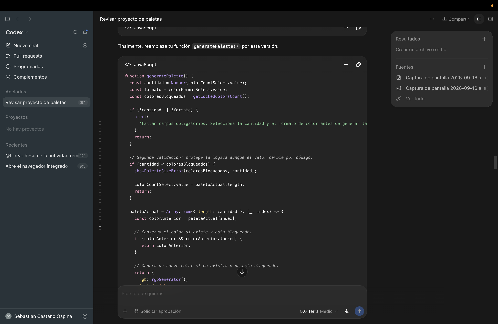
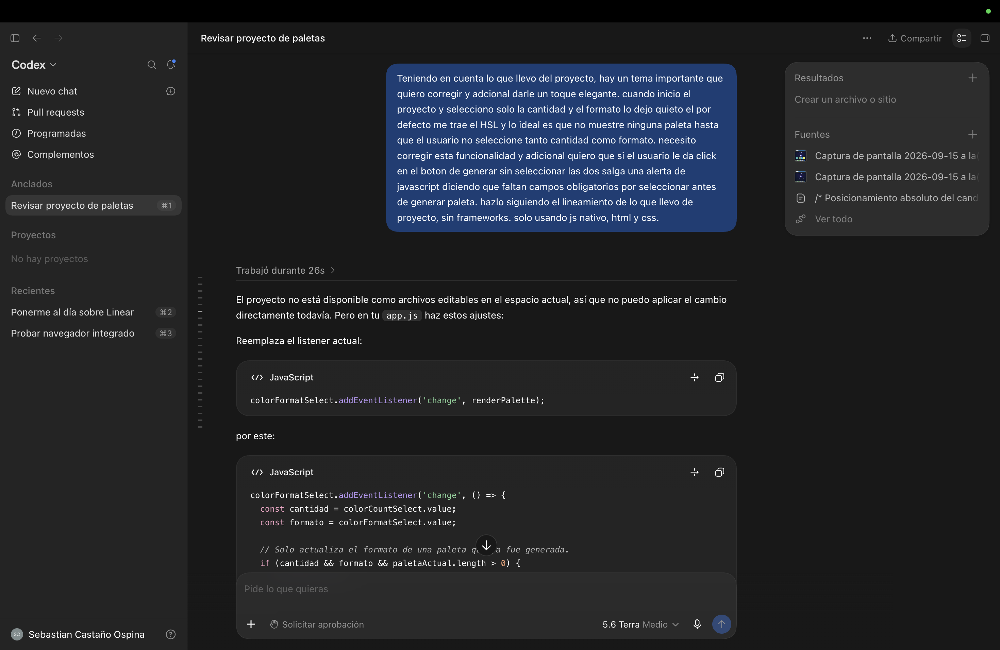
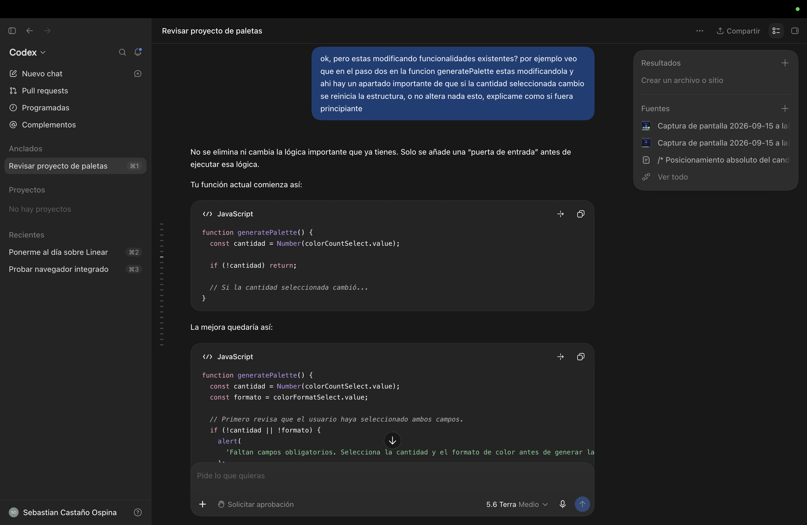

# Documentación del uso de inteligencia artificial

## Propósito

Durante el desarrollo del proyecto se utilizó inteligencia artificial como herramienta de apoyo para comprender conceptos de JavaScript, revisar la lógica existente y evaluar alternativas de implementación. Las sugerencias fueron adaptadas, integradas y probadas dentro del proyecto.

## Consultas principales

### 1. Estructura base y lógica de generación de la paleta

**Consulta:** ¿Cómo estructurar el HTML de forma semántica y accesible, y cómo construir la lógica de generación de colores (RGB, conversión a HEX y HSL) y su renderizado dinámico en pantalla?

**Resultado aplicado:** Se definió una estructura HTML con `header`, `main` y `footer`, labels asociados a los selects, y un flujo donde la paleta no se genera hasta que el usuario presiona el botón. Se construyeron las funciones `rgbGenerator`, `rgbToHex` y `rgbToHsl`, y se separó la lógica en `generatePalette()` (genera colores nuevos y los guarda en un array) y `renderPalette()` (dibuja los colores existentes), lo que permite mantener la misma paleta al cambiar el formato de color.

### 2. Validación antes de generar una paleta

**Consulta:** ¿Cómo evitar que se genere o muestre una paleta si el usuario no ha seleccionado la cantidad de colores y el formato?

**Resultado aplicado:** Se añadieron validaciones en JavaScript para comprobar ambos campos antes de generar. Cuando falta alguno, se muestra una alerta nativa que informa al usuario.

### 3. Bloqueo de colores al cambiar el tamaño de la paleta

**Consulta:** ¿Cómo mantener los colores bloqueados al pasar, por ejemplo, de 6 a 8 colores?

**Resultado aplicado:** Se ajustó la generación para conservar los colores bloqueados que continúan dentro de la nueva cantidad seleccionada y generar nuevos colores para las posiciones no bloqueadas.

### 4. Persistencia de la paleta

**Consulta:** ¿Cómo conservar la paleta actual después de recargar la página?

**Resultado aplicado:** Se utilizó `localStorage` para almacenar la cantidad, el formato, los valores RGB y el estado de bloqueo de cada color. Al recargar, la aplicación recupera esos datos y vuelve a renderizar la paleta.

### 5. Guardado de paletas favoritas

**Consulta:** ¿Cómo permitir que el usuario guarde una paleta y la vea posteriormente en pantalla?

**Resultado aplicado:** Se creó una sección visual de paletas guardadas. Cada paleta se muestra como una miniatura, puede cargarse nuevamente en el generador y eliminarse cuando el usuario lo necesite. La información también se conserva con `localStorage`.

### 6. Copia del código de un color

**Consulta:** ¿Cuál es una forma compacta de copiar el código de un color al hacer clic sobre su tarjeta?

**Resultado aplicado:** Se utilizó delegación de eventos sobre el contenedor principal de la paleta y la API `navigator.clipboard`. Esto permite copiar el valor HEX o HSL sin crear un evento independiente para cada tarjeta.

### 7. Ajustes de interfaz

**Consulta:** ¿Cómo organizar los botones principales en una fila y mantener el footer al final de la página?

**Resultado aplicado:** Se usó Flexbox en CSS para organizar los botones de forma horizontal en escritorio y vertical en pantallas pequeñas. También se aplicó una estructura flexible al `body` para que el footer permanezca al final del contenido sin superponerse a la paleta.

## Aprendizajes obtenidos

- Manipulación dinámica del DOM con JavaScript nativo.
- Lógica de conversión de color (RGB a HEX y HSL).
- Uso de `localStorage` para persistir datos en el navegador.
- Uso de eventos y delegación de eventos.
- Organización de interfaces con Flexbox.
- Validación de formularios y retroalimentación para el usuario.

## Evidencias

Se adjuntan capturas de las consultas realizadas y de las funcionalidades implementadas en la carpeta de documentación del proyecto.s

# Documentación del uso de IA

Este documento reúne consultas realizadas con inteligencia artificial como apoyo durante el desarrollo del proyecto.

## Apoyo visual para CSS

## Consulta sobre Array

## Consulta sobre definición visual

## Consulta sobre formato de colores

## Corrección de botones

## Corrección del formato de color

## Corrección de bloqueo — Parte 1

## Corrección de bloqueo — Parte 2

## Corrección de bloqueo — Parte 3

## Duda sobre funcionalidad

## Guardar paleta de colores

s

## Revisión de las funciones max y min

## Validación de cálculo aleatorio

## Validación y bloqueo

## Validación de campos

---

[← Volver al README principal](../README.MD)
