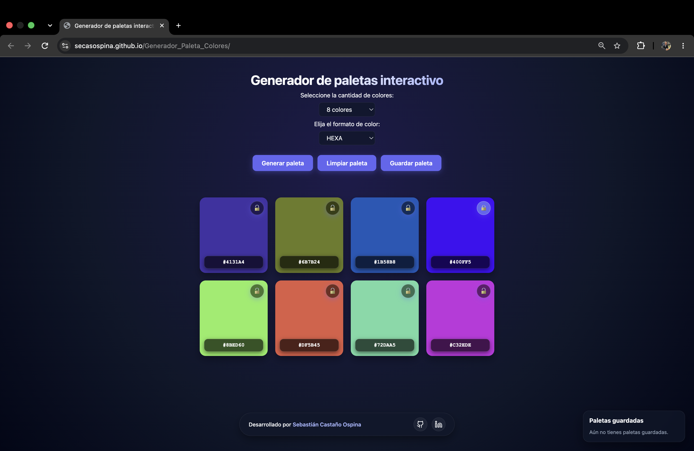
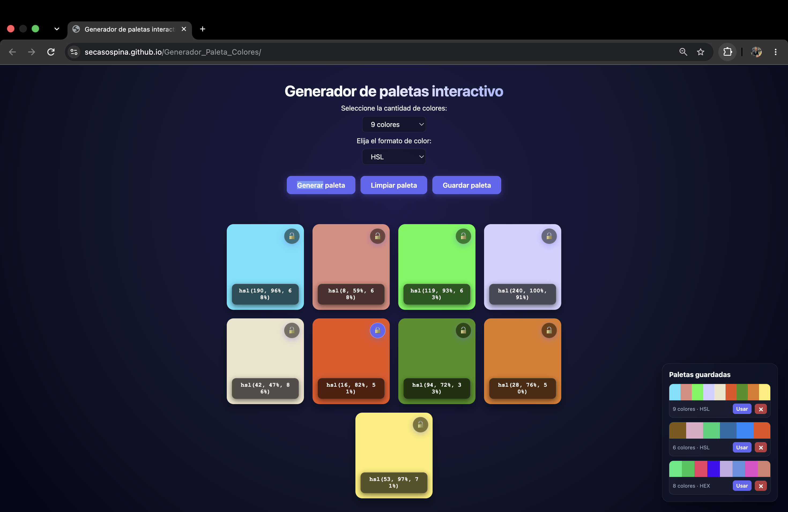

# Generador de paletas interactivo

Aplicación web estática e interactiva para crear, personalizar y conservar paletas de colores. El usuario puede generar colores aleatorios, bloquear sus favoritos, cambiar el formato de visualización, copiar códigos al portapapeles y guardar paletas para volver a utilizarlas más adelante.

Este proyecto fue desarrollado como Proyecto Integrador del Módulo 1 del bootcamp Full Stack.

## Enlaces

- **Demo en GitHub Pages:** [Paleta de colores interactiva](https://secasospina.github.io/Generador_Paleta_Colores/)
- **Repositorio:** [Repositorio](URL_DEL_REPOSITOhttps://github.com/secasospina/Generador_Paleta_ColoresRIO)
- **Documentación del uso de IA:** [Documentación uso de la IA](./Documentación/AI_Promting.MD)

## Vista previa




## Funcionalidades

### Generación y visualización

- Selección de paletas de **6, 8 o 9 colores**.
- Generación de colores aleatorios mediante el botón **Generar paleta**.
- Visualización del valor de cada color en formato **HEX** o **HSL**.
- Cambio de formato sin necesidad de crear una paleta nueva.
- Validación de campos obligatorios antes de generar la paleta.

### Interacción con colores

- Bloqueo y desbloqueo individual de cada color.
- Conservación de los colores bloqueados al regenerar la paleta.
- Conservación de los candados al aumentar o reducir la cantidad de colores, siempre que el color permanezca visible.
- Copia del código HEX o HSL al portapapeles al hacer clic sobre una tarjeta.

### Persistencia y paletas favoritas

- La última paleta generada se conserva al recargar la página.
- Persistencia de cantidad, formato, colores y estado de los candados mediante `localStorage`.
- Guardado de paletas favoritas como miniaturas visuales.
- Recuperación de una paleta guardada con el botón **Usar**.
- Eliminación individual de paletas guardadas.
- Botón **Limpiar paleta** para borrar la paleta de trabajo actual.

### Interfaz y accesibilidad

- Diseño oscuro con detalles de glassmorphism y transiciones sutiles.
- Botones principales organizados en fila en escritorio y adaptados a pantallas pequeñas.
- Panel compacto de paletas guardadas.
- Uso de HTML semántico: `header`, `main`, `aside` y `footer`.
- `label` asociados a los controles de selección.
- Botones nativos para las acciones principales y etiquetas `aria-label` en enlaces y acciones complementarias.
- Microfeedback mediante alertas al validar campos, guardar una paleta y copiar un código.

## Tecnologías utilizadas

| Tecnología   | Uso                                                   |
| ------------ | ----------------------------------------------------- |
| HTML5        | Estructura semántica de la aplicación                 |
| CSS3         | Diseño, layout responsivo, Flexbox y efectos visuales |
| JavaScript   | Lógica de generación, manipulación del DOM y eventos  |
| localStorage | Persistencia local de paletas y preferencias          |
| Git y GitHub | Control de versiones y publicación                    |
| GitHub Pages | Despliegue de la demo                                 |

## Estructura sugerida

```text
ProyectoM1_SebastianCastanoOspina/
├── index.html
├── style.css
├── app.js
├── Documentacion/
│   ├── capturasYflujo/
│   │   ├── app-paleta-generada.png
│   │   ├── app-paletas-guardadas.png
│   │   └─ SoportesIA
│   └── AI_Promting.md
└── README.md
```

## Cómo usar la aplicación

1. Selecciona la cantidad de colores: **6**, **8** o **9**.
2. Elige el formato de visualización: **HEX** o **HSL**.
3. Haz clic en **Generar paleta**.
4. Pulsa el candado de un color para conservarlo en la siguiente generación.
5. Haz clic sobre una tarjeta para copiar su código al portapapeles.
6. Usa **Guardar paleta** para añadir la combinación actual al panel de paletas guardadas.
7. Desde ese panel, selecciona **Usar** para recuperarla o `×` para eliminarla.

## Ejecución local

Este proyecto no requiere instalaciones ni dependencias externas.

1. Clona el repositorio:

   ```bash
   git clone URL_DEL_REPOSITORIO
   ```

2. Entra a la carpeta del proyecto:

   ```bash
   cd ProyectoM1_SebastianCastanoOspina

   ```

3. Abre `index.html` en tu navegador.

También puedes abrirlo con la extensión **Live Server** de Visual Studio Code. Para probar la copia al portapapeles se recomienda usar Live Server o la demo desplegada, ya que la API `navigator.clipboard` funciona en contextos seguros como `localhost` y GitHub Pages.

## Decisiones técnicas

- Cada color se guarda internamente como un objeto RGB. De este modo, un mismo color puede convertirse a HEX o HSL sin modificar su valor original.
- La variable `paletaActual` centraliza el estado de la paleta, incluido el valor RGB y la propiedad `locked` de cada color.
- Al regenerar o cambiar la cantidad, se conserva cada color bloqueado que continúa dentro del tamaño seleccionado; los demás reciben nuevos valores aleatorios.
- El renderizado se realiza dinámicamente con JavaScript y el DOM, sin frameworks ni librerías externas.
- La copia de color utiliza la API moderna `navigator.clipboard` y delegación de eventos sobre el contenedor de la paleta.
- Se utilizan dos claves de `localStorage`: una para la paleta de trabajo actual y otra para la colección de paletas favoritas.

## Persistencia de datos

La información se guarda únicamente en el navegador de la persona usuaria mediante `localStorage`. Por esta razón, las paletas persistirán al recargar la página en el mismo navegador, pero no se sincronizan con otros dispositivos o navegadores.

## Documentación del uso de IA

La inteligencia artificial se utilizó como apoyo para comprender conceptos, evaluar alternativas y revisar soluciones puntuales. La implementación fue adaptada e integrada dentro del proyecto.

Consulta el detalle de los temas abordados, los resultados aplicados y las evidencias en [Documentación de IA](./Documentación/uso-de-ia.md).

## Próximas mejoras

- Reemplazar algunas alertas por un toast visual no intrusivo.
- Permitir nombrar las paletas guardadas.
- Añadir una opción para exportar una paleta como archivo o imagen.
- Incorporar contraste dinámico para mejorar la lectura sobre cualquier color.

## Autor

**Sebastián Castaño Ospina**

- [GitHub](https://github.com/secasospina)
- [LinkedIn](https://www.linkedin.com/in/sebastiancastanoo/)
